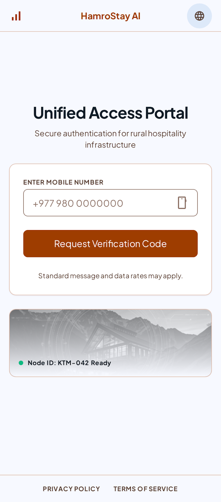
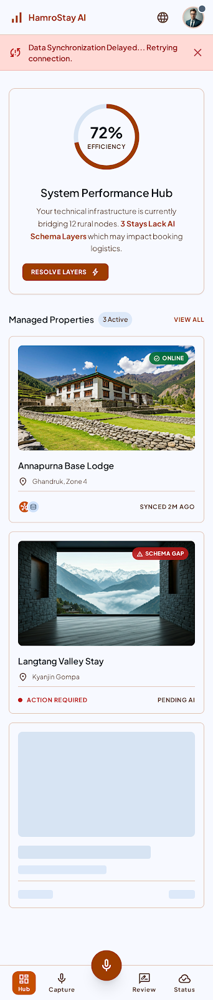
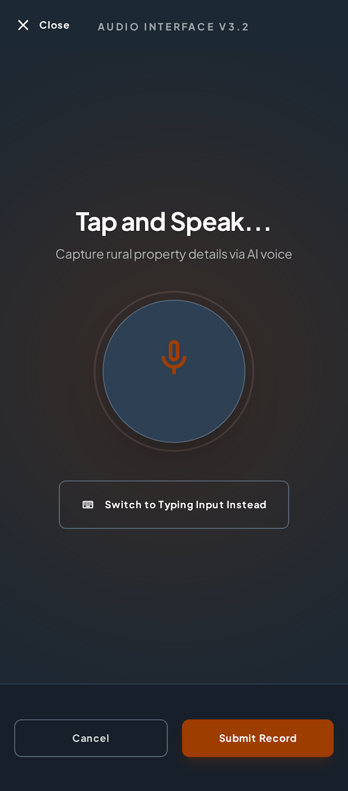
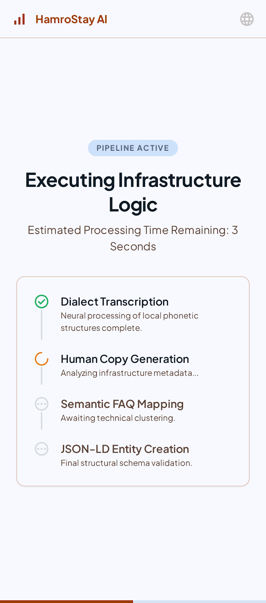
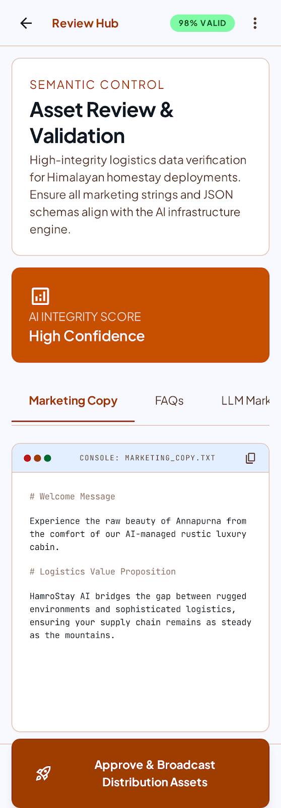
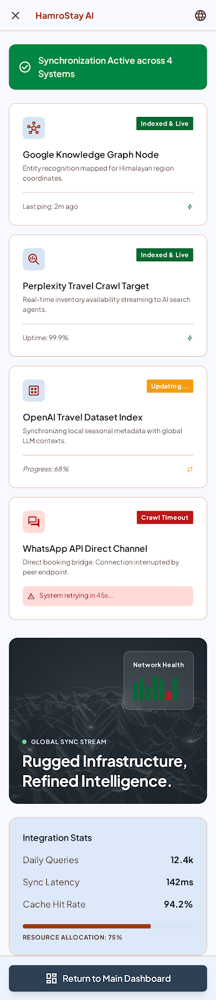
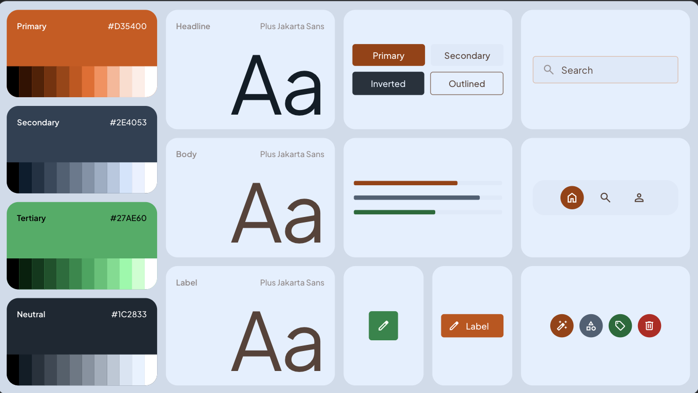
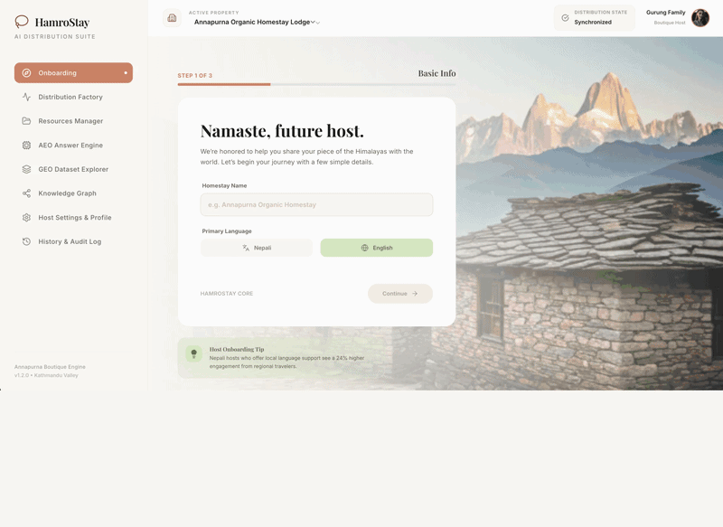

# Google Agentic Product Harness

Eight prompt templates that take a raw startup idea to a deployed, market-ready product, plus a decoupled Stage 00 founder-fit pre-check — using Gemini, Google Antigravity, and NotebookLM.

[](LICENSE)
[](#the-eight-stage-pipeline)
[](#model-settings)
[](#how-to-run-it)
[](#stage-08-outputs--notebooklm)
[](#bonus-stage-founder-fit-pre-check)
[](https://hamrostay-dist-8239.web.app/)

> **New here?** Start with the interactive setup guide before running any prompts:
> **[📋 Installation Guide →](https://indranildchandra.github.io/google-agentic-product-harness/installation-guide.html)**
> Covers Antigravity installation, Node.js setup, Firebase project creation, and deploy — all in one page.
>
> **See the harness in action:** **[hamrostay-dist-8239.web.app](https://hamrostay-dist-8239.web.app/)** → 
> A full end-to-end run of all eight stages against a real startup idea, vibe-coded in ~15 minutes using Antigravity.
>
> **Desktop browser only** → the [Stitch project](https://stitch.withgoogle.com/projects/9198422885981226206) produces a mobile design, but the example app is a web version built for demonstration purposes and is not yet responsive.

---

## Table of contents

- [Quick start](#quick-start)
- [What this is](#what-this-is)
- [Bonus Stage: Founder Fit Pre-Check](#bonus-stage-founder-fit-pre-check)
- [The eight-stage pipeline](#the-eight-stage-pipeline)
- [Pipeline overview](#pipeline-overview)
- [How to run it](#how-to-run-it)
- [What makes these prompts different](#what-makes-these-prompts-different)
- [Live Demo: HamroStay AI](#live-demo-hamrostay-ai)
- [Repository structure](#repository-structure)
- [Contributing](#contributing)
- [License](#license)

---

## Quick start

1. **Describe your idea**: open [Stage 01](prompts/01-market-researcher.md) in Gemini 3.1 Pro. Answer 3 questions. Get a full TAM/SAM/SOM analysis with a GO/HOLD/NO-GO verdict.
2. **Validate it**: paste the Stage 01 output into [Stage 02](prompts/02-idea-validator.md). Get a competitive matrix, moat analysis, and defensibility score.
3. **Design it**: paste both outputs into [Stage 03](prompts/03-workflow-generator.md). Get a screen inventory + Stitch-ready frame prompts. Paste them into [Google Stitch](https://stitch.withgoogle.com/) to generate high-fidelity UI screens.
4. **Build it**: hand the Stage 03 outputs and Stitch Design DNA to a developer running [Stages 04–06](prompts/) in Google Antigravity. Get a deployed React app with a phase-by-phase changelog.
5. **Ship it**: run [Stage 07](prompts/07-build-reviewer.md) against the live URL for a severity-triaged bug report, then upload everything to NotebookLM and run [Stage 08](prompts/08-pitch-deck-generator.md) to generate the investor deck.
6. **Present it**: upload all `.md` files from `.product-harness/` as NotebookLM sources and run [Stage 08](prompts/08-pitch-deck-generator.md). Get a 10-slide investor deck following the Sequoia seed template, grounded in your own research and build output.

---

## What this is

This harness is a structured sequence of prompts, not a codebase. Each prompt is a standalone agent instruction designed to produce a specific artifact that feeds the next stage. Run them in order. Each prompt tells you which model to use and what inputs it needs.

**The artifact chain:** every stage produces one or more `.md` files. Those files are the exact content you paste or upload when the next stage asks for its inputs. Nothing is lost between stages — the chain is self-contained. Stages 01–05 also append any `[ASSUMPTION]` tags they produce to a shared `.product-harness/assumptions.md`, which Stage 07 reads before auditing to surface compounding risk across the full pipeline.

**Who this is for:** stages 01–03 are accessible to any founder — no coding required. Stages 04–07 use Google Antigravity (Google's autonomous multi-agent coding environment) and produce agent definitions, architecture specs, test suites, and a running codebase — you will need a technical co-founder or developer to run and verify those outputs. Stage 08 is back to non-technical: it runs inside NotebookLM.

---

## Bonus Stage: Founder Fit Pre-Check

> **Who this is for.** Founders who are seriously contemplating leaving something good behind — a stable salary, a senior title, or a safe career path — to pursue a startup idea full-time. If you are running this harness as a learning exercise or exploring casually, skip this entirely. It is built for the person standing at the door asking: *is this the bet I make with the next 3–5 years of my life?*
>
> **What it is not.** This stage is completely decoupled from the eight-stage pipeline. It does not produce market research. It does not feed Stage 01. It does not talk to Gemini's search tools. It produces one artifact — `founder-fit.md` — and it answers one question: *does this founder, with this idea, in this market, at this moment, have the structural foundation to justify the bet?*

### How it works

[Stage 00](prompts/00-founder-fit-pre-check.md) is a seven-round structured interrogation run in any capable conversational AI. It supports two modes: **Interrogation mode** (the model asks one probe question at a time, with a sharpening challenge on vague answers) and **Batch mode** (paste all your answers at once using a provided template; the model flags evidence gaps before scoring). Both modes apply the same 0–20 rubric per round based on the quality and specificity of your evidence, not your self-assessment.

| Round | Dimension | The question it answers | Evidence that earns 20 points |
|-------|-----------|-------------------------|-------------------------------|
| 1 | Pain Depth | Is this a bleeding wound or a paper cut — and has the founder seen it bleed directly, not inferred it from a distance? | Named person + unprompted complaint + quantified cost in money or hours + proof of an existing payment for a partial solution |
| 2 | Substitution Resistance | Is the target customer functionally locked into solving this problem, or can they simply stop and lose nothing? | Specific recurring workaround described step-by-step; founder has directly observed it in use; evidence that abandoning it would cause real operational damage |
| 3 | Timing Lock | Are infrastructure, behaviour, and market conditions aligned right now — and can the founder name the exact event that opened the window? | Three existing customer behaviours with platform + frequency; a named enabling event in the last 24 months; awareness of a prior timing failure and what is structurally different today |
| 4 | Asymmetric Founder Advantage | Does the founder hold advantages that a well-resourced competitor cannot replicate by writing a cheque in the next six months? | Two or more un-buyable advantages (lived experience, unique access, named relationships, proprietary data); five or more named early customers with a specific trust reason; named prior work with a verifiable outcome |
| 5 | Market Ceiling | Is the addressable market large enough to build a venture-scale business — and has the founder run the actual arithmetic, not just asserted the size? | Step-by-step Fermi calculation with a defensible Year 5 ceiling; named Year 3 adjacent market with an existing incumbent; named comparable company with a specific expansion mechanism |
| 6 | Field Evidence | Has the founder spoken to non-affiliated strangers with the problem — by name, not by count — and did those conversations break any prior assumptions? | Three or more named non-affiliated strangers; one materially corrected prior assumption; a near-stop-pursue objection and the specific reasoning that resolved it |
| 7 | Obsession Resilience | Is the founder's commitment grounded in specific anger and documented prior sacrifice — not enthusiasm, curiosity, or career ambition? | Specific anger-trigger moment tied to the problem; one hard sacrifice made before external validation existed; a proud-in-failure narrative with named actions, not outcomes |

**Maximum score: 140 points.**

| Band | Score | Verdict |
|------|-------|---------|
| I | 112–140 | **EXECUTE** — all seven pillars are load-bearing. Time is the only remaining enemy. |
| II | 84–111 | **PROCEED WITH CONDITIONS** — fewer than three dimensions are failing. Close those gaps before leaving your current role. |
| III | 56–83 | **REFINE BEFORE COMMITTING** — at least three dimensions are structurally weak. Fix core issues before spending capital or career equity. |
| IV | 28–55 | **STAND DOWN** — the founder-problem-timing combination is not ready. The stage produces a specific gap analysis and 30-day action plan. |
| V | 0–27 | **ABORT** — this is not your idea, not your timing, or both. Neither is a failure. Both are better than a preventable three-year loss. |

**Model:** Gemini 3.1 Pro or any capable conversational AI (temperature 0.4, Google Search off — this stage interrogates the founder, not the market).

**To run:** open [Stage 00](prompts/00-founder-fit-pre-check.md), paste it into your AI of choice, and answer the three setup questions (idea, geography, and session format). Interrogation mode takes 20–40 minutes; Batch mode takes 10–15 minutes. Save the output as `founder-fit.md`. It is a private decision instrument — revisit it in 90 days.

---

## The eight-stage pipeline

| # | Prompt | Model | Input | Output |
|---|--------|-------|-------|--------|
| 01 | [Market Researcher](prompts/01-market-researcher.md) | Gemini 3.1 Pro | Raw idea, target geography, target audience | `market-research.md` — TAM/SAM/SOM, personas, tailwinds/headwinds, GO/HOLD/NO-GO verdict |
| 02 | [Idea Validator](prompts/02-idea-validator.md) | Gemini 3.1 Pro | `market-research.md` | `idea-validation.md` — competitive matrix, moat analysis, pre-mortem, defensibility score |
| 03 | [Workflow Generator](prompts/03-workflow-generator.md) | Gemini 3.1 Pro | `market-research.md` + `idea-validation.md` | `workflow-system.md` (architecture truth) + `workflow-stitch-pack.md` (one Stitch prompt per screen) |
| 04 | [Agentic SDLC Architect](prompts/04-agentic-sdlc-architect.md) | Gemini 3.5 Flash (Antigravity) | `workflow-system.md` + `workflow-stitch-pack.md` + Stitch Design DNA (via MCP) | `architecture.md` + `agents.md` + `tdd.md` |
| 05 | [Build Planner](prompts/05-build-planner.md) | Gemini 3.5 Flash (Antigravity Planning Mode) | `architecture.md` + `agents.md` + `tdd.md` + Stitch design output | `build-plan.md` — phased execution plan for Antigravity Manager view |
| 06 | [Build Executor](prompts/06-build-executor.md) | Gemini 3.5 Flash (Antigravity) | `build-plan.md` + all Stage 04 files | Running codebase + `changelog.md` — live record of what was built, phase by phase |
| 07 | [Build Reviewer](prompts/07-build-reviewer.md) | Gemini 3.5 Flash + browser tool | Live deployment URL + `changelog.md` + all upstream `.md` files | `issues.md` + `backlog.md` — severity-triaged bugs and feedable next-sprint backlog |
| 08 | [Pitch Deck Generator](prompts/08-pitch-deck-generator.md) | NotebookLM | All upstream `.md` files as sources | 10-slide investor pitch deck following the [Sequoia seed template](https://sequoiacap.com/article/writing-a-business-plan/) |

---

## Pipeline overview

```text
Your startup idea
      │
      ▼
┌────────────────────────────────────────────────────────┐
│ 01  MARKET RESEARCHER                  Gemini 3.1 Pro  │
│     TAM/SAM/SOM · Personas · GO/HOLD/NO-GO             │
└──────────────────┬─────────────────────────────────────┘
          NO-GO ───┘  stop or revise assumptions
          GO
          │
          ▼
┌───────────────────────────────────────────────────────┐
│ 02  IDEA VALIDATOR                     Gemini 3.1 Pro │
│     Competitive Matrix · Moat · Defensibility Score   │
└──────────────────┬────────────────────────────────────┘
                   │
                   ▼
┌───────────────────────────────────────────────────────┐
│ 03  WORKFLOW GENERATOR                 Gemini 3.1 Pro │
│     Screen Inventory · Tokens · Stitch Frame Pack     │
└──────────────────┬────────────────────────────────────┘
                   │  workflow-stitch-pack.md
                   ▼
     ┌──────────────────────────────────────────────────────┐
     │   GOOGLE STITCH                                      │
     │   Paste frame prompts · Design DNA generated         │
     └─────────────────┬────────────────────────────────────┘
                       │  Stitch MCP auto-ingests Design DNA
        ╔══════════════╧════════════════════════╗
        ║   HAND OFF TO DEVELOPER               ║
        ║   Install Stitch MCP in Antigravity   ║
        ║   Verify bridge · paste API key       ║
        ╚══════════════╤════════════════════════╝
                       │
                       ▼
┌──────────────────────────────────────────────────────────────┐
│ 04  AGENTIC SDLC ARCHITECT  Gemini 3.5 Flash (Antigravity)   │
│     Architecture · Agent Topology · TDD Spec                 │
└──────────────────┬───────────────────────────────────────────┘
                   │
                   ▼
┌──────────────────────────────────────────────────────┐
│ 05  BUILD PLANNER    Gemini 3.5 Flash (Antigravity)  │
│     Phased Plan · Parallel Workspaces · Autonomy     │
└──────────────────┬───────────────────────────────────┘
                   │
                   ▼
┌──────────────────────────────────────────────────────┐
│ 06  BUILD EXECUTOR   Gemini 3.5 Flash (Antigravity)  │
│     Phase-by-Phase Build · Verify · changelog.md     │
└──────────────────┬───────────────────────────────────┘
                   │  built codebase
                   ▼
     ┌─────────────────────────────────────────────┐
     │   FIREBASE DEPLOY  (free Spark plan)         │
     │   firebase build && firebase deploy          │
     │   → live HTTPS URL                           │
     └──────────────────┬──────────────────────────┘
                        │  live URL
                        ▼
┌───────────────────────────────────────────────────────┐
│ 07  BUILD REVIEWER       Gemini 3.5 Flash + browser   │
│     Live Audit · issues.md · backlog.md               │
└──────────────────┬────────────────────────────────────┘
                   │
                   ▼
┌─────────────────────────────────────────────────────┐
│ 08  PITCH DECK GENERATOR               NotebookLM   │
│     Sequoia Template · Source-Grounded · 10 Slides  │
└──────────────────┬──────────────────────────────────┘
                   │
          investor feedback?
          └─► return to the stage that owns
              the challenged assumption
```

---

## How to run it

### Prerequisites

- Access to Gemini 3.1 Pro or an equivalent deep research model (for stages 01–03)
- Access to Gemini 3.5 Flash or an equivalent model supporting low, medium & high effort modes (for stages 04–07)
- Access to Google Antigravity (for stages 04–07)
- Access to NotebookLM (for stage 08)
- Access to Google Stitch (for stage 03 design output)
- A Stitch API key (for MCP bridge between Stitch and Antigravity at Stage 04) — see [codelab](https://codelabs.developers.google.com/design-to-code-with-antigravity-stitch#0)
- Node.js 24.x (required for Antigravity stages 04–07) — see `install_scripts/` or open the [interactive setup guide](https://indranildchandra.github.io/google-agentic-product-harness/installation-guide.html) for the full walkthrough

Note: The entire stack used in this harness supports freemium model and does not require any paid subscription to get started.

### Step-by-step

1. **Copy the prompt** from the relevant file in `prompts/`.
2. **Paste it into the correct model** (each prompt file specifies which one in its ROLE section).
3. **Answer the questions** — each prompt opens with an input collection step that asks for what it needs. Paste document content inline or upload files when prompted.
4. **Save the output** into `.product-harness/` in your project directory (e.g. `.product-harness/market-research.md`). This keeps all generated artifacts in one folder that can be excluded from production deployments via `.gitignore` or CI/CD ignore rules.
5. **The next stage reads it automatically** — stages 04–07 check `.product-harness/` first and only ask if a file is missing.

Before running stages 04–07 in Antigravity, ensure Node.js 24.x is installed. Run `install_scripts/setup-node-linux-mac.sh` (macOS/Linux) or `install_scripts/setup-node-win.ps1` (Windows) — each script detects an existing install and skips if already on Node 24.

Stages 01–03 are linear and synchronous — run them in Gemini chat one at a time. Stages 04–07 run inside Antigravity. Stages 04–05 can run as parallel agents inside Antigravity Manager view. Stage 06 executes sequentially phase by phase and logs each step to `.product-harness/changelog.md`.

### Stitch → Antigravity MCP bridge (between Stage 03 and Stage 04)

Stage 03 produces `workflow-stitch-pack.md` — a set of frame prompts you paste into [Google Stitch](https://stitch.withgoogle.com/) to generate high-fidelity UI screens. Instead of manually exporting assets, the **Stitch MCP server** lets Antigravity fetch the Design DNA (design tokens, layout metadata, component specs) directly from your Stitch project. Follow the [Google Codelab: Design-to-Code with Antigravity and Stitch](https://codelabs.developers.google.com/design-to-code-with-antigravity-stitch#0) to set this up — the steps are:

1. In Google Stitch, go to **Profile → Stitch settings → API key → Create key**. Copy and store the key securely.
2. Open Antigravity IDE. Press **CMD+E** (Mac) or **CTRL+E** (Windows) to open Agent Manager → **MCP Servers**.
3. Open the MCP store via the `...` dropdown. Search **"Stitch"** → **Install** → paste your API key when prompted.
4. Verify the bridge: type `List my Stitch projects.` in the Agent chat. If it returns your project name, the connection is live.
5. Stage 04 agents can now call `fetch Design DNA` and Antigravity will pull layout, tokens, and component metadata straight from Stitch — no manual export needed.

### Model settings

| Stage | Temperature | Thinking budget | Grounding |
|-------|-------------|-----------------|-----------|
| 01, 02 | 0.4 | High | Google Search on |
| 03 | 0.4 | Medium | None |
| 04, 05, 06 | NA | Medium | Antigravity execution environment (Gemini 3.5 Flash) |
| 07 | NA | NA | Antigravity Chrome dev browser tool |
| 08 | NA | NA | NotebookLM sources |

---

## What makes these prompts different

**Grounding is mandatory.** Every quantitative claim in stages 01–02 must be tagged `[VERIFIED: source, year]` or `[ASSUMPTION: reasoning]`. No untagged numbers.

**Self-critique is enforced.** Stages 01–04 use a three-pass structure: draft, grade against a rubric (scored out of 50, threshold 40), revise the weakest sections. The model shows its score.

**Stitch-aware output.** Stage 03 splits workflow output into a system doc and a per-screen frame pack where each Stitch prompt is under 4500 characters — Stitch's working limit before it starts dropping components.

**Agents have contracts.** Stage 04 defines each Antigravity sub-agent with explicit tool budgets, termination conditions, failure escalation paths, and verifiable Artifact contracts. Agents that finish without producing a checkable Artifact are not considered done.

**Circuit breakers are built in.** Stages 05 and 06 cap retries at 3. After 3 failures, the agent records a FAILED entry and pauses — it does not loop silently.

**Execution is logged phase by phase.** Stage 06 writes a `changelog.md` entry after every phase with verification evidence — not a summary at the end. If the build is interrupted at any point, the changelog reflects exactly how far it got.

**Audit output is feedable.** Stage 07 reads `changelog.md` alongside the live deployment, so every bug can be traced back to the phase that introduced it. Backlog items are written as ready-to-paste prompts for the next build cycle.

**Kill signal propagates.** If Stage 01 returns NO-GO, the pipeline stops and asks the user to either revise the idea or consciously accept the risk before Stage 02 runs. Stage 02 also checks the incoming verdict and refuses to run on a NO-GO.

**Input validation at every boundary.** Stages 02–07 open by checking that incoming documents have all required sections. Missing sections are flagged before any analysis runs — not discovered halfway through.

**Assumptions are aggregated.** Every `[ASSUMPTION]` tag produced across stages 01–05 is appended to `.product-harness/assumptions.md` using a structured format: assumption ID, claim, source section, risk level, and validation status (⬜ Unvalidated by default). Stage 07 reads this file before auditing and updates the status of each assumption against live behavior.

**Developer handoff is explicit.** Stage 03 ends with a one-page handoff package: what the developer receives, which decisions are locked, which are still open, and the first question they should ask.

**Feedback loop closes the cycle.** Stage 08 ends with a structured investor-feedback routing table — each objection maps back to the upstream stage that owns the challenged assumption, so the pipeline can be re-entered cleanly rather than patching the deck. The pitch structure follows the [Sequoia seed template](https://sequoiacap.com/article/writing-a-business-plan/).

**Portable.** The grounding and structured-output mechanics map to Claude (`web_search` + structured output) and GPT (function calling + browsing). Stages 04–06 are Antigravity-native but can be run manually with Cursor / Claude Code as well with minor modifications.

---

## Live Demo: HamroStay AI

The `demo/` folder contains a complete end-to-end run of this harness against a real startup idea: **HamroStay AI**, a localized AI distribution engine that turns rural Nepali homestay hosts' voice notes into structured, AI-discoverable property listings.

Every artifact below was produced by running the eight prompts in order — no manual editing between stages.

| Stage | What happened | Live link |
|---|---|---|
| 01–03 | Market Researcher → Idea Validator → Workflow Generator in Gemini | [Gemini chat transcript](https://gemini.google.com/share/4a0c8ad17a67) · [Harness artifacts](demo/product_harness_artifacts/) |
| 03 → Stitch | Pasted the six Stitch frame prompts into Google Stitch | [Live Stitch project](https://stitch.withgoogle.com/projects/9198422885981226206) |
| 04–06 | Agentic SDLC Architect → Build Planner → Build Executor in Antigravity | `demo/example_project/` |
| 07 | Build Reviewer run against the live deployment — issues and backlog generated | [hamrostay-dist-8239.web.app](https://hamrostay-dist-8239.web.app/) |
| 08 | All `.md` files from `demo/product_harness_artifacts/` uploaded to NotebookLM, Pitch Deck Generator run | [Pitch deck](https://docs.google.com/presentation/d/1tNHDM2Rez33Tm4qBRmsVdYZIBDZ-M8z6/view) |

### Stitch mobile screens — generated from the frame prompts

Six high-fidelity mobile screens produced by pasting `workflow-stitch-pack.md` prompts directly into [Google Stitch](https://stitch.withgoogle.com/projects/9198422885981226206). No manual design work.

<table width="100%">
<tr>
<td align="center" valign="top" width="33%"><b>S01 — Auth Portal</b><br></td>
<td align="center" valign="top" width="33%"><b>S02 — Dashboard</b><br></td>
<td align="center" valign="top" width="34%"><b>S03 — Audio Intake</b><br></td>
</tr>
<tr>
<td align="center" valign="top" width="33%"><b>S04 — Processing State</b><br></td>
<td align="center" valign="top" width="33%"><b>S05 — Review Hub</b><br></td>
<td align="center" valign="top" width="34%"><b>S06 — Distribution Status</b><br></td>
</tr>
</table>

**Design topology** — the token and component architecture underlying all six screens:



### Stage 08 outputs — NotebookLM

**Pitch deck** — 10 slides following the [Sequoia seed template](https://sequoiacap.com/article/writing-a-business-plan/), generated by uploading all upstream `.md` files as NotebookLM sources and running the Stage 08 prompt. No manual slide creation.

[View the full pitch deck →](https://docs.google.com/presentation/d/1tNHDM2Rez33Tm4qBRmsVdYZIBDZ-M8z6/view)

**Mind map** — auto-generated by NotebookLM from the same source set. Useful as a visual reference for the elevator pitch and for spotting how the market, moat, and product workflow connect across stages.


### Harness artifacts — the chain in full

These are the exact files produced by stages 01–03. Each feeds the next stage with no edits.

| File | Stage | What it contains |
|---|---|---|
| [demo_problem_statement.md](demo/demo_problem_statement.md) | Input | Raw startup idea submitted to Stage 01 |
| [market-research.md](demo/product_harness_artifacts/market-research.md) | 01 | TAM $25.2M global / $864K Nepal SAM, 3 personas, GO verdict, 45/50 self-score |
| [idea-validation.md](demo/product_harness_artifacts/idea-validation.md) | 02 | Competitive matrix (4 players), 4 defensibility moats, 3 pre-mortem failure modes, 42/50 defensibility score |
| [workflow-system.md](demo/product_harness_artifacts/workflow-system.md) | 03 | Product persona, design token library, 2 user journeys, 6-screen inventory, interaction specs, maker-checker audit log, developer handoff package |
| [workflow-stitch-pack.md](demo/product_harness_artifacts/workflow-stitch-pack.md) | 03 | Six Stitch frame prompts (S01–S06), each under 4500 chars, ready to paste into Google Stitch |
| [assumptions.md](demo/product_harness_artifacts/assumptions.md) | 01–03 | 8 structured assumptions (A01–A08) with claim, section, risk-if-wrong, and validation status |
| [geminichat-log.md](demo/geminichat-log.md) | 01–03 | Full Gemini chat transcript — raw responses and every self-critique pass |

### Demo walkthrough



> GIF quality is reduced for inline preview. For the full-quality recording, download [hamrostay-ai-demo.mp4](demo/demo_artifacts/hamrostay-ai-demo.mp4).
>
> Desktop browser only — the app is a web-first demonstration and is not yet responsive on mobile.

---

## Repository structure

```text
prompts/                            # Prompt templates
  00-founder-fit-pre-check.md       # Bonus Stage — decoupled founder-fit interrogation (produces founder-fit.md)
  01-market-researcher.md
  02-idea-validator.md
  03-workflow-generator.md
  04-agentic-sdlc-architect.md
  05-build-planner.md
  06-build-executor.md
  07-build-reviewer.md
  08-pitch-deck-generator.md

install_scripts/                    # Node.js 24.x setup for Antigravity sessions
  setup-node-linux-mac.sh           # macOS / Linux: installs nvm + Node 24, patches PATH
  setup-node-win.ps1                # Windows: installs Node 24 LTS MSI, refreshes env vars

docs/                               # GitHub Pages source — https://indranildchandra.github.io/google-agentic-product-harness/
  installation-guide.html           # Interactive setup guide — Antigravity install, Node.js,
                                    #   Firebase project, CLI login, firebase init, build and deploy

demo/                               # End-to-end worked example — HamroStay AI
  demo_problem_statement.md         # Raw startup idea fed into Stage 01
  geminichat-log.md                 # Gemini chat response transcript for stages 01–03

  demo_artifacts/                   # Desktop web app screenshots, demo GIF, and screen recording

  product_harness_artifacts/        # Stage 01–03 outputs from the HamroStay AI run
    market-research.md              # Stage 01 output
    idea-validation.md              # Stage 02 output
    workflow-system.md              # Stage 03 output — product persona, screen inventory, journeys
    workflow-stitch-pack.md         # Stage 03 output — six Stitch frame prompts
    assumptions.md                  # Running assumption log (A01–A08 across stages 01–03)

  stitch_mobile_design_artifacts/   # Google Stitch output — six generated mobile screens
    screen1/ … screen6/             # Per-screen folder: screen.png, code.html, DESIGN.md
    technical_grounding/            # Design DNA reference image, DESIGN.md

  example_project/                  # React + Vite + TypeScript app scaffolded from the harness output
    src/                            # Pages, components, context, types
    public/                         # Static assets
    package.json / vite.config.ts / tsconfig.json

  notebooklm_artifacts/             # Stage 08 outputs from NotebookLM
    HamroStay AI - Deck.pdf         # 10-slide investor pitch deck (Sequoia template)
    HamroStay AI - Mind Map.png     # Auto-generated concept map from all harness sources

.product-harness/                   # Generated at runtime in your own project
  market-research.md                # Stage 01 output
  idea-validation.md                # Stage 02 output
  workflow-system.md                # Stage 03 output
  workflow-stitch-pack.md           # Stage 03 output
  architecture.md                   # Stage 04 output
  agents.md                         # Stage 04 output
  tdd.md                            # Stage 04 output
  build-plan.md                     # Stage 05 output
  assumptions.md                    # Appended by stages 01–05, read by stage 07
  changelog.md                      # Appended by stage 06, read by stage 07
  issues.md                         # Stage 07 output
  backlog.md                        # Stage 07 output
```

---

## Contributing

Improvements to the prompt templates, new demo runs, and corrections to the artifact chain are all welcome.

1. Fork the repo and create a branch from `main`.
2. Make your changes to the relevant prompt file(s) in `prompts/`.
3. If you ran a full demo, add it to `demo/` following the existing folder structure.
4. Open a pull request with a description of what changed and why.

For significant prompt redesigns, open an issue first so the approach can be discussed before implementation.

---

## License

[MIT](LICENSE)
